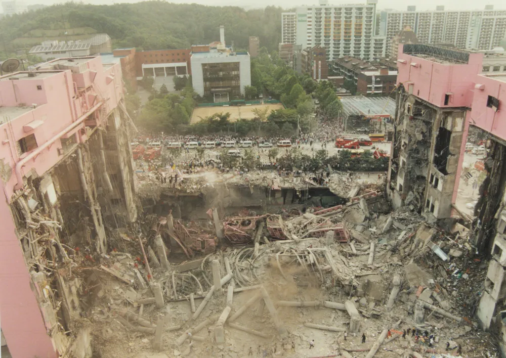
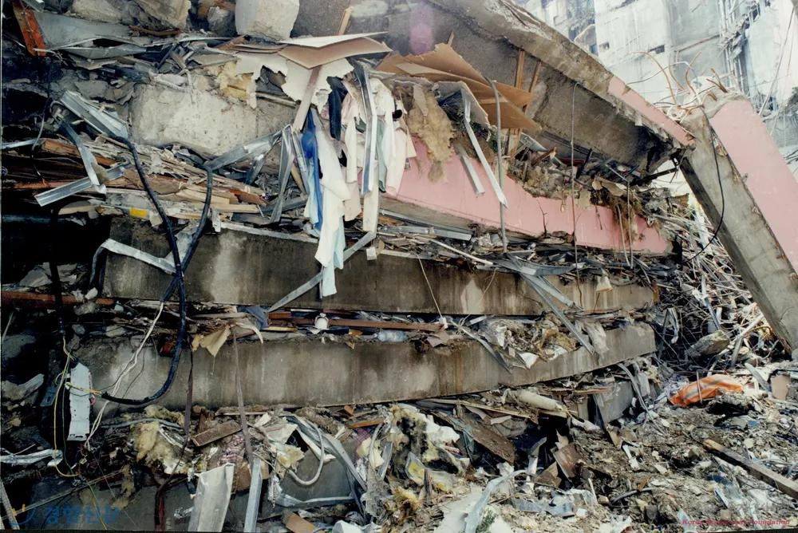

---

### Download

+ [Extended Abstract](sampoong_abstract.pdf)
+ [Presentation](sampoong_slides.pdf)

---

### Introduction
The Sampoong Department Store collapse is one of the most catastrophic failures in modern history. This five-story, reinforced concrete building completely collapsed, resulting in over 500 deaths and many more injured. The store was completed in 1989 and was in service for 5 years before the devastating collapse.In April of 1995, noticeable cracks in the slabs began to form in the south wing of the building's fifth floor. The cracks began to expand exponentially in the following months, but no action was taken except the relocation of merchandise from the 5th floor to the basement. On June 29, 1995 at around 5:00 p.m. South Korea Standard Time, the 5th floor began to sag, prompting workers to block customer access to the 4th floor and 5th floors. At around 5:50 pm, a series of cracking and banging sounds came from the 5th floor, and the workers sounded the alarms. At 5:57 the building collapsed as shown in Figure 1.

### Construction Deficiencies
(Park 2018) Reports that design changes to the structure were made at the same time as key engineering drawings and calculations were completed by the structural engineer, which resulted in fatal mistakes in reinforcing bar volumes in some sections.(Tae Won Park et al., 2011). Upon investigation, tested concrete less than the originally designed 21 MPa with tested results of 18.4 MPa.The structural deficiencies in the department store were due to the use of undersized columns and slabs, and improperly placing the rebar with inconsistent top cover. This decision to use smaller columns was reduced the building’s ability to support live and dead loads. These deficiencies caused the building to be vulnerable to excessive deflections and stress concentrations. Improperly moved 138 ton A/C added 7 KPa live load on roof and impacted the safety factors. The improper relocation of the air conditioner unit to the roof increased the live load beyond the design capacity. The 5th floor was originally designed for a roller skating rink. After construction, the building changed its use of the fifth floor to a restaurant, which resulted in a 47% increase in unfactored load shown in Table 1. The cooling tower also was installed in an area which obstructed views of nearby residential buildings, which also were reported to have residents complaining about the noise of the unit. To solve this problem, the unit was moved to the opposite end of the building, using rollers installed on plates for the convenience of work. Consequently, this caused structural damage to the building, especially in the plates which are used to distribute load.

### Failure Mechanisms of the Collapse
One of the major contributing factors was punching shear failure. Flat slabs are practical in some builds due to the reduced weight they provide to the dead load of a structure. They also require less formwork and are easy to construct. They do however pose a critical analysis problem because the bending moments and shear forces are concentrated at the slab column connection. Punching shear strength in flat slab design is important not only due to the brittle nature of the component, but also because it may induce a progressive collapse through the structure resulting in a stack as seen in Figure 2 and Figure 3. Due to the inadequate slab thickness, steel reinforcement, the failure spread quickly and led to the collapse of the department store. The lack of shear reinforcement further reduced the structure’s ability to resist stress concentrations and led to rapid structural failure. There were a number of issues with the slab column configuration. The cover from the top of one of the basement level slabs to the center of the reinforced concrete bar was found to be 150mm instead of 30mm which reduced the bending strength by around 40% of the designed bending strength the slab was intended to support. 

### Ethics Concerns
The collapse was a result of negligence, ethical violations, and prioritizing financial gain over safety. Early warning signs such as visible cracks in the building were ignored by the management team to prevent financial loss due to stores closing. According to Park (2018), the store executives were aware of the structural issues but failed to act responsibly. The decision to prioritize profit over public safety led to the failure of the department store. Engineering professionals that were involved also failed to uphold their duty to report unsafe conditions, raising questions about professional integrity in the construction industry (Tae Won Park et al., 2011). Engineers and inspectors who raised concerns about structural issues were ignored and corrective actions were not taken. This lack of regulatory enforcement contributed to the increased risk of failure. 

---
### Figures

###### Figure 1: Aftermath of the collapse

###### Figure 2: evidence of punching shear on the morning of the collapse.

###### Figure 3: floor slabs due to progressive collapse.

---

##### Citations

Park, T. W. (2012). Inspection of collapse cause of sampoong department store. Forensic Science International, 217(1), 119-126. https://doi.org/10.1016/j.forsciint.2011.10.039  

Gardner, N. J., Huh, J., & Chung, L. (2002). Lessons from the sampoong department store collapse. Cement & Concrete Composites, 24(6), 523-529. https://doi.org/10.1016/S0958-9465(01)00068-3  

Heo, L., Gil, S., & Collova, N. (2022). 30 years after the sampoong department store collapse: Development of south korean building sector. Journal of Student Research (Houston, Tex.), 11(3)https://doi.org/10.47611/jsrhs.v11i3.2946  

Seoul Metropolitan City. (1996). Sampoong Department Store Collapse Accident White Paper (No. MONO1199606952). National Assembly Library. Retrieved March 21, 2025, from https://dl.nanet.go.kr/detail/MONO1199606952  

Schreiber-Ziegler, Hilda, and Moritz-Maria von Igelfeld. 2021. "Your Inner Hedgehog." *Journal of Socio-Experimental Psychology* 131 (2): 1299–1302.